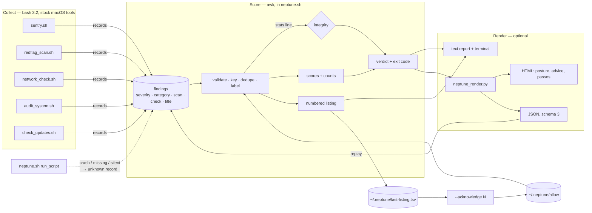

# Architecture

Neptune is three layers with one rule between them: **findings are recorded,
never scraped.** A scan decides what it found and writes it down as a record;
everything downstream — scores, verdict, exit code, text, HTML, JSON — renders
from those records. Nothing re-reads printed prose to work out what happened
(that was [DEVLOG Bug 8](DEVLOG.md)).

## Layer 1 — collection (the scans)

Five independent scripts, each runnable on its own. Each check sets a stable
`CHECK` id and calls a helper that prints a line **and** records it:

| Helper | Severity | Meaning |
|---|---|---|
| `flag` / `bad` | `attention` | needs a decision |
| `warn` / `upd` | `notice` | minor, or worth knowing |
| `unknown` | `unknown` | the check could not run — never a pass |
| `info` | `info` | about the run itself (a baseline was created); costs nothing |
| `pass` | `pass` | the check ran and found nothing — so the report can prove coverage |

Records are one line: `severity|category|scan|check|title`. The title is
escaped at write time (`|` → `/`, tabs and newlines → spaces), so a title can
never add a field. Everything runs under `LC_ALL=C`: macOS awk aborts
mid-program on invalid UTF-8 in a UTF-8 locale, and `lsof` truncates names to a
byte count, so half a character is a normal input ([Bug 13](DEVLOG.md)).

In the full suite (`NEPTUNE_SUITE=1`), a check two scans both know how to do —
double NAT, the persistence listing — is done once, by the scan that owns it.
One problem, one finding, one deduction.

## Layer 2 — scoring (awk, no dependencies)

`neptune.sh` holds the pipeline as functions, above a `NEPTUNE_LIB` guard so
the tests can source and call the code that ships rather than a copy of it.

- **`nep_score_records`** validates each record, derives its acknowledge key
  (lowercased, digits collapsed so it survives PIDs and versions, capped at 90
  bytes by adding *whole words* — slicing can split a character), attaches a
  vendor label from `vendor-quirks.tsv`, drops exact duplicates, and writes a
  stats line **in `END`**. If awk dies part-way, there is no stats line.
- **`nep_run_pipeline`** fails closed: no stats line, a record count that does
  not add up, or zero records at all turns integrity off. Malformed lines become
  an `unknown` finding saying how many. With integrity off, the verdict can at
  best read *incomplete*.
- **`nep_compute_scores`**: each category starts at 100. The first problem of a
  severity costs full weight, repeats about a third — nine unsigned helpers are
  usually one vendor habit, and a flat deduction floors at 0 and stops
  distinguishing "several quirks" from "compromised". Acknowledged findings stay
  counted and stop deducting.
- **`nep_verdict`** / **`nep_exit_status`**: worst first. Attention → 1. An
  integrity failure or any unknown → 2. Only a complete, clean run → 0.
- **`nep_listing`** numbers the actionable list once and saves it, so
  `--acknowledge 5` resolves against the list you read ([Bug 14](DEVLOG.md)).

## Layer 3 — rendering (python, optional)

`neptune_render.py` is only reached with `--html`, `--json` or `--replay`, and
only when `python_ok` confirms a real interpreter (on a Mac without the Command
Line Tools, `/usr/bin/python3` is a stub that opens an install dialog).

It owns the one **remediation table**, keyed by check id: what a finding means,
what to do, and — only where a documented single-purpose command exists — that
command, labelled by what it does. `unknown` results get "could not check"
advice rather than the fix for a failure. The HTML is static: no script, no
external request.

`--replay` feeds a saved JSON (or findings file) back through the *real*
pipeline rather than trusting the numbers stored inside, which is also how CI
tests the renderer without a Mac.

## Layer 4 — fixing (guided, optional)

`./neptune.sh --fix` execs `fix.sh`, which reads the saved listing — now with the
check id as its sixth column — and asks `plan_for <check> <title> <n>` what to
offer: **run** (a documented command or a Neptune hand-off), **open** (a System
Settings pane), or **guide** (instructions, where no honest command exists). One
action is offered once even when several findings share it (one upgrade run
covers macOS, Homebrew and App Store items). Every applied fix is logged; the
session ends with an offer to re-scan, which is what makes the HTML report's
"since last run" deltas the proof that the fix worked.

## The destructive side

`uninstall.sh`, `remove_mackeeper.sh` and `clean_caches.sh` share one shape —
discover, show, confirm, act, verify — and one test seam: `NEPTUNE_ROOT`, a path
prefix that can only narrow what they reach and disables `sudo` while set.
`tests/blast_radius.sh` builds a hostile fake filesystem under it and asserts
the delete set is exactly the target's files, then performs a real delete and
checks the survivors.

## Tests and CI

| Suite | Runs on | Covers |
|---|---|---|
| `tests/unit.sh` | Linux + macOS (bash 3.2) | the real pipeline functions and each scan's parsers, sourced with `NEPTUNE_LIB=1` |
| `tests/test_render.py` | Linux + macOS | remediation coverage and command safety, sanitizer, HTML invariants, JSON round trip, `--replay` end to end |
| `tests/blast_radius.sh` | Linux + macOS | what the three destructive scripts would delete, and do delete |
| `tests/macos.sh` | macOS | the platform assumptions: bash 3.2, BWK awk's abort, real `codesign`, real `PlistBuddy` |
| `tests/e2e_assert.py` | macOS | a real full run on the runner: every scan completed, integrity held, every posture control checked, exit code matches verdict |
| `tests/lint.sh` | both | `bash -n`, shellcheck, bash 3.2 grep gates, destructive-script guardrails — and runs all of the above |
